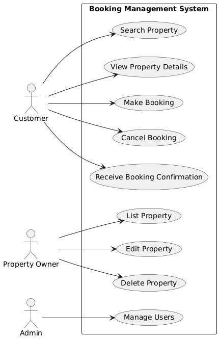

# Requirement Analysis in Software Development

## Introduction
This repository is created to document and explore the concept of **Requirement Analysis** in the Software Development Lifecycle (SDLC).  

## What is Requirement Analysis?
Requirement Analysis is the process of **gathering, understanding, documenting, and managing the needs and expectations** of stakeholders for a software system.  
It is a crucial phase in the **Software Development Lifecycle (SDLC)** because it lays the foundation for designing, developing, and testing the system. Without well-defined requirements, software projects risk failure, scope creep, or delivering a product that does not meet user expectations.
### Why is Requirement Analysis Important?
1. **Clarity and Understanding**: Ensures developers, testers, and stakeholders have a common understanding.  
2. **Minimizes Risks**: Reduces chances of project failure by identifying constraints early.  
3. **Improves Quality**: Helps deliver a system that meets actual user needs.  
4. **Saves Time and Cost**: Prevents rework and costly fixes later in the development cycle.

## Key Activities in Requirement Analysis
- **Requirement Gathering** – Collecting information from all stakeholders (clients, end users, managers, developers) to understand what the system should achieve.  
- **Requirement Elicitation** – Using techniques like interviews, questionnaires, brainstorming sessions, workshops, and observation to uncover both stated and hidden needs. 
- **Requirement Documentation** – Organizing the gathered requirements into clear, detailed documents (e.g., Software Requirement Specification – SRS) to serve as a reference for the whole project.  
- **Requirement Analysis and Modeling** – Examining requirements for feasibility, consistency, and conflicts, and representing them through models (e.g., UML diagrams, use cases, prototypes) to better visualize the system.  
- **Requirement Validation** – Reviewing requirements with stakeholders through walkthroughs, inspections, and prototyping to ensure they are correct, complete, testable, and aligned with business objectives.
  
## Types of Requirements

### Functional Requirements  
Functional requirements define what the system should do — the specific features and functions of the software.  
**Examples for Booking Management Project:**  
- Users can search for available properties by location, date, and price.  
- The system allows customers to create, update, and cancel bookings.  
- Property owners can list, edit, and remove their properties.  
- The system sends booking confirmation emails to customers.  

### Non-functional Requirements  
Non-functional requirements describe how the system performs — the quality attributes that define its usability and performance.  
**Examples for Booking Management Project:**  
- The system must handle up to 10,000 concurrent users.  
- Pages should load within 2 seconds under normal load.  
- The application must be accessible on mobile, tablet, and desktop devices.  
- Data must be encrypted to ensure secure transactions.
  
## Use Case Diagrams
A **Use Case Diagram** is a visual representation of the interactions between system users (actors) and the system itself. It helps stakeholders understand the functionality of the system at a high level and ensures that all required features are captured.  
### Benefits of Use Case Diagrams:
- Provide a clear picture of system functionality.  
- Help identify different user roles and their interactions.  
- Serve as a communication tool between stakeholders, analysts, and developers.  
- Make it easier to validate requirements and avoid missing key functionalities.  

---

### Use Case Diagram for Booking Management System
Below is a sample use case diagram that illustrates the interactions between actors (Customer, Property Owner, Admin) and the system:  

## Acceptance Criteria

**Acceptance Criteria** are specific conditions that a software feature must meet to be considered complete and working correctly. They ensure that the system fulfills the requirements and help developers, testers, and stakeholders have a shared understanding of what “done” means.

**Importance:**
- Ensures features meet user expectations.
- Helps testers verify functionality.
- Reduces misunderstandings between stakeholders and developers.

**Example – Checkout Feature:**
- User must be able to select a payment method.
- Payment must be processed securely.
- Confirmation of booking must be displayed after successful payment.
- User receives a confirmation email with booking details.

